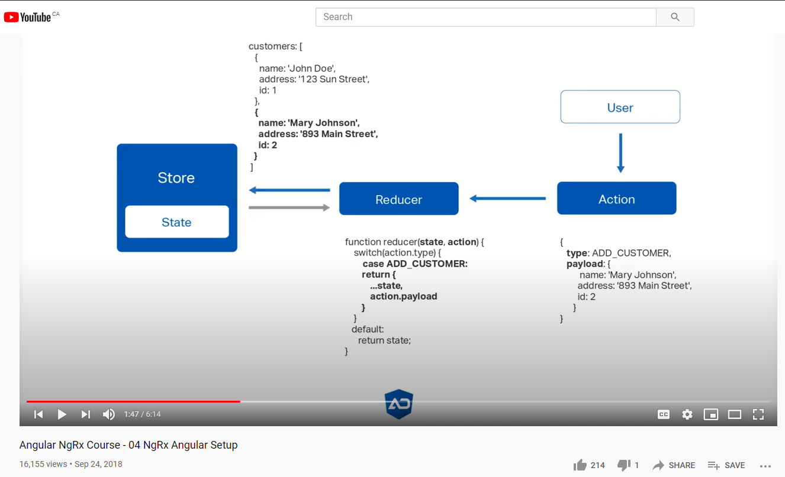
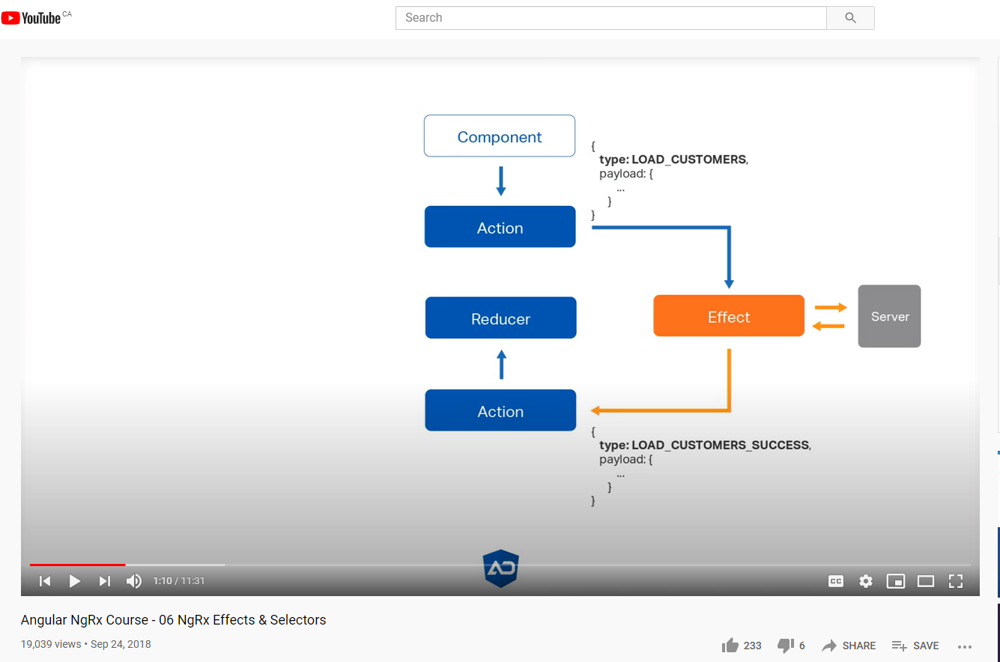
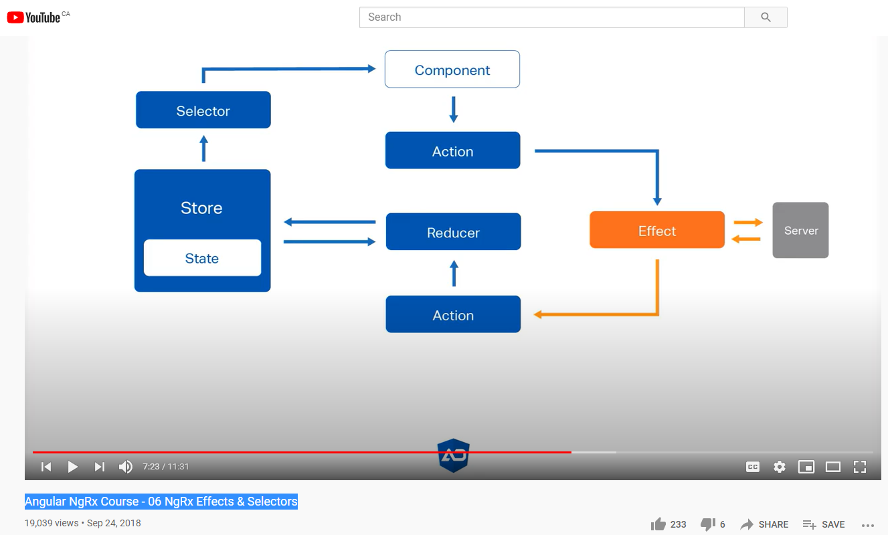
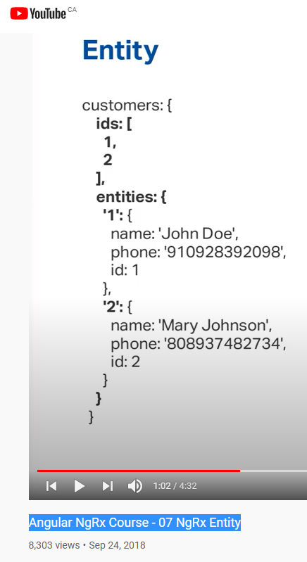

# AngularNgrxStoreCustomer

ng new angular-ngrx-store-customer

npm install @ngrx/store

import { StoreModule } from "@ngrx/store";

npm install @ngrx/store @ngrx/effects @ngrx/router-store @ngrx/entity  @ngrx/store-devtools

https://angulardeveloper.io/blog/2019/07/19/angular-ngrx-setup/ <------------- problem, use YouTube instead

https://github.com/angulardeveloper-io/ngrx-store-app.git

git clone https://github.com/angulardeveloper-io/ngrx-store-app.git ngrx-store-customer-orig

### Angular NgRx Course - 04 NgRx Angular Setup

https://www.youtube.com/watch?v=ChiAZJiX3v0&list=PLaMbwDs23r4KXoMucJEyUAvamQ-kFNBvC&index=4

working till
00:41

### Angular NgRx Course - 05 NgRx Store-Devtools & Action Types

https://www.youtube.com/watch?v=1dQVJ1DaFWU&list=PLaMbwDs23r4KXoMucJEyUAvamQ-kFNBvC&index=5

### Angular NgRx Course - 06 NgRx Effects & Selectors

AngularNgRxCourse.06NgRxEffectsAndSelectors.01.PNG

AngularNgRxCourse.06NgRxEffectsAndSelectors.02.PNG

### Angular NgRx Course - 07 NgRx Entity

@ngrx/entity: manage entities with id[] array to improve performance.

### Angular NgRx Course - 08 CRUD

### Angular NgRx Course - 09 NgRx Router Store

#### Router-Store

- Binds the Angular router to NgRx
- Where we are in the application
- Add route, the route parameters and the query parameters to the state
- Custom Serializer

